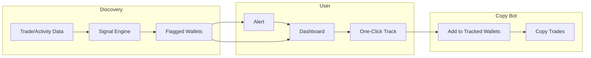

# Early Discovery & Emerging Whales — Vision & Plan

**Date:** 2025-02-24  
**Audience:** Team (product, engineering, stakeholders)  
**Purpose:** Present the vision, rationale, and plan for finding high-value Polymarket wallets **early** — before they climb the public leaderboard — and wiring that into our copy bot via flag → alert → copy.

---

## Executive summary

Today our bot copies wallets the user already knows. The biggest opportunity is **discovering high-value wallets early** — potential new whales, insiders, and unusual activity — so we can copy them **before** they become obvious on the leaderboard. This document outlines what “early discovery” means, which signals we want to detect, how it fits with whale watching / leaderboard / alerts, and how we can build it (same repo first, optional separate service later). The end-to-end flow is: **discovery flags interesting wallets → user gets an alert → one click adds them to the copy list.**

---

## 1. Problem and opportunity

**Problem**

- Following the **top Polymarket leaderboard** only captures wallets that are already famous. By the time a wallet is in the top 10 by volume or PnL, a lot of the upside may already be in the rearview.
- Our bot today assumes users **already have** wallet addresses to paste. We don’t help them **find** who to copy. That limits who gets value from the product and how early they can act.

**Opportunity**

- The edge is in **being early**: finding wallets that are **about to** or **just starting to** outperform — new whales, insiders, unusual trades, and weird new high-value positions — and making it trivial to **flag them, get alerted, and start copying** in one flow.
- If we can surface “potential new whale” or “unusual activity” **before** they climb the leaderboard, we give users a way to capture gains from emerging alpha, not just from already-proven leaders. That’s how we extract real value from the bot.

**Goal (north star)**

- **Find high-value wallets early in their lifecycle.** Detect and flag: potential new whales, insiders, unusual trades/movements, and new high-value positions. Alert the user and let them **one-click add to tracked wallets** so the existing copy bot does the rest. Discovery and copy bot work together as one product experience.

---

## 2. User flow: flag → alert → copy

We want a single, clear flow from “system finds someone interesting” to “user is copying them.”

**In words**

1. **Discovery** ingests trade/activity data (Polymarket Activity API, optional CLOB stream), runs a **signal engine** (rules for “new wallet + big size,” “volume spike,” “unusual trade,” etc.), and produces a list of **flagged wallets** with a reason per flag.
2. **Alert** fires when a wallet is flagged (e.g. “New potential whale: 0x… opened $5k on Market X. Reason: New wallet, large size.”). Delivery: in-app feed first; later Telegram/Discord.
3. **Dashboard** shows the same flagged list (e.g. “Emerging” or “Flagged” tab) so the user can browse and decide.
4. **One-click “Track”** adds that wallet to the copy bot’s tracked list (existing `addTradingWallet` flow). No new execution logic — we just feed new addresses into the bot.
5. **Copy bot** continues to work as today: it copies trades from all tracked wallets, including newly added ones.

Discovery can live in the same repo as new modules or in a separate service; either way, the **product experience** is one flow: flag → alert → copy.

---

## 3. What we mean by “early discovery” and “emerging whales”

**Early discovery** = detecting wallets that are **not yet** on the public “top by volume/PnL” leaderboard but show **signals** that they might become high performers. We want to surface them **before** they climb the leaderboard.

**Emerging whale** = a wallet that is either:

- **New to our radar** and already taking large or concentrated positions (no history with us, but high conviction), or
- **Existing** but showing a sudden step-change: volume spike, unusual trade size, or timing that looks “insider-like.”

**We explicitly want to flag**

- Potential **new whales** (early in lifecycle, big size or concentration).
- **Insiders** (timing of trades relative to events/resolution).
- **Unusual trades and movements** (size or volume far above that wallet’s or that market’s norm).
- **Weird new high-value positions** (e.g. large position in a market that usually has small flow, or a new wallet showing up with one big bet).

The leaderboard remains useful for “who’s already winning”; the **flagged / emerging** view is “who might be the next winner.” We want both, with the emphasis on **finding them early**.

---

## 4. Signals we want to detect (detailed)

These are the kinds of signals the discovery system would use to **flag** a wallet. Each can be implemented as a rule with configurable thresholds.

| Signal | What we detect | Why it’s useful | Implementation notes |
|--------|----------------|-----------------|----------------------|
| **New wallet, large size** | First time we see this wallet, and they open a position above $X (e.g. $1k, $5k). | No history = can’t be on leaderboard yet; large first position suggests conviction or inside info. | Need a “universe” of wallets to observe (seed list or trade stream). Store first-seen time; flag when first-seen and size > threshold. |
| **Volume spike** | Wallet’s recent volume (e.g. 24h or 7d) is 2–5x their own baseline (e.g. previous week or rolling average). | Step-change in activity often precedes big moves or a climb up the leaderboard. | Per-wallet rolling volume and baseline; flag when ratio exceeds threshold. Requires some history per wallet. |
| **Unusual trade size** | Single trade or position size far above (a) that wallet’s typical size, or (b) that market’s typical trade size. | One-off large bets often signal conviction or information. | Per-wallet and/or per-market size distribution (e.g. median, p90); flag when current trade > N× median or p90. |
| **Insider-like timing** | Wallet opens a large position shortly before a major move (e.g. resolution, big price move, or news). | Suggests information advantage. | Harder: need “major move” definition (e.g. resolution outcome, or price move > X%). Time window (e.g. 24–48h before). Can start with “large position in market that resolves in next 7 days” as a proxy. |
| **Concentration / conviction** | Wallet has few, large positions (high concentration) vs many small bets. | Concentrated books often indicate strong views. | Optional: e.g. “top 3 positions = Y% of total exposure” or Herfindahl-style score. Flag when above threshold. |
| **New high-value position (weird)** | A market that usually has small flow suddenly gets a large position from a wallet (new or existing). | Unusual flow into a specific market can be informational. | Per-market typical size; flag when a single trade or position is > N× market’s typical. |

**Priority for v1**

- Start with **new wallet + large size** and **volume spike** (if we have baseline). Both are easier to implement and don’t require “major move” or resolution data.
- Add **unusual trade size** once we have per-wallet and/or per-market size stats.
- **Insider-like timing** and **concentration** can be phase 2.

**Data needs**

- To see “new” wallets and compute volume/spike we need either:
  - **Option A:** A **broad feed** of trades (e.g. CLOB/stream or “recent trades by market”) so we see any wallet that trades, or
  - **Option B:** A **seed list** of candidate addresses (e.g. from recent fill data, market makers, or manual curation) and we only score those. Option B is simpler for v1; Option A scales better for “find anyone.”

---

## 5. How this fits with Whale watching, Leaderboard, and Alerts

These three features are **reframed** around early discovery; they share one data pipeline and one product story.

**Whale watching (discovery & tracking)**

- **Reframe:** Not only “see who has high volume/PnL” but “see who is **emerging** as a potential whale” (flagged by our signals) and who is already on top. Two lists: “Flagged / emerging” and “Top by volume (leaderboard).”
- **Same pipeline:** Ingestion + aggregation (volume, PnL where we have it) + **signal layer** that produces flags. Whale watching UI shows both “Track” for leaderboard wallets and “Track” for flagged wallets.

**Leaderboard**

- **Reframe:** “Top by volume/PnL” = **trailing** view (who’s already winning). Add a second view: **“Emerging / Flagged”** = wallets that don’t yet rank in top N but were flagged (new wallet + big size, volume spike, unusual trade, etc.). Same backend, two tabs or filters.
- **Unified flow:** User can copy from leaderboard (proven) or from flagged list (early). One-click “Track” in both cases.

**Alerts**

- **Reframe:** Alerts include **discovery/flag alerts**. When we flag a wallet, we send: “New potential whale: 0x… — Reason: [Volume spike 3x / New wallet $5k position / Unusual size on Market X]. [View] [Track].” In-app feed first; later Telegram/Discord. “Track” adds the wallet to the copy bot.
- **Integration:** Copy-trade alerts (we copied something) and price alerts (market crossed level) stay as planned. **Discovery pipeline** becomes a new source of events: “wallet flagged” → alert. Alerts are the **bridge** between “we found someone interesting” and “user adds them to copy.”

---

## 6. Architecture: same repo vs separate service

We have two ways to build discovery so it works with the copy bot.

**Option A: Same repo (new modules)**

- Add discovery as **modules** in the current repo (e.g. `discovery/`, `signals/`). They run in the same process (or a dedicated “discovery” script/worker) and share config and dashboard.
- **Pros:** One codebase, one deploy, easy to call existing `addTradingWallet` and share API. Good for v1 with candidate-list + Activity API + polling.
- **Cons:** If we later need CLOB-wide streaming and heavy storage, the repo gets bigger and discovery’s scale concerns mix with the bot’s.

**Option B: Separate discovery service**

- A **separate service** (different process or repo) that ingests trade/activity data, runs the signal engine, stores flagged wallets, and exposes an API (e.g. `GET /flagged`, webhooks for “new flag”). The copy bot and dashboard call this service; “Track” still adds the wallet into the bot’s stored list.
- **Pros:** Discovery can scale (streaming, DB, workers) independently; copy bot stays simple and safe. Clear boundary.
- **Cons:** Two deploys, API contract and auth, more ops. Overkill for v1 if we start with a candidate list and polling.

**Recommendation**

- **Start with Option A** (modules in current repo, candidate list + Polymarket Activity API + rolling stats + signal rules). Ship “Flagged / emerging” list and in-app alerts and one-click Track.
- **Revisit Option B** if we outgrow that (e.g. CLOB-wide stream, many markets, low-latency scoring). The **product flow** (flag → alert → copy) stays the same; only the deployment boundary would change.

---

## 7. Implementation phases (high level)

**Phase 1 — Foundation (same repo)**

- **Data:** Seed list of candidate wallets (e.g. from recent Polymarket activity or manual curation). Poll Polymarket Activity API per wallet (or batch) on a schedule (e.g. every 5–15 min). Store first-seen, rolling volume, last N trades in SQLite or existing DB.
- **Signals:** Implement 1–2 rules: (1) **New wallet + large size** (first time we see wallet, position size > configurable $X). (2) **Volume spike** (e.g. 24h volume > 2× previous 7d average) if we have enough history.
- **API:** Endpoints for “flagged wallets” and “leaderboard (top by volume).” Dashboard: “Leaderboard” tab and “Flagged / Emerging” tab; each row has “Track” calling existing add-wallet.
- **Alerts:** When a wallet is flagged, append to an in-app alert feed (and optionally in-dashboard list). Alert text includes reason (e.g. “New wallet, $5k position”). “Track” from alert adds wallet to bot.
- **No change** to copy execution, rate limits, or safety invariants.

**Phase 2 — Richer signals and UX**

- Add **unusual trade size** (per-wallet and/or per-market). Optional: **concentration / conviction** score.
- Tune thresholds and add simple filters (e.g. min size, market category).
- Optional: **Telegram or Discord** notifier for flag alerts (configurable webhook/bot token).

**Phase 3 — Scale (optional)**

- If we need to “see everyone”: move to **CLOB/stream** ingestion and/or larger candidate set; consider extracting discovery into **separate service** with its own storage and API. Keep bot and dashboard as consumers; “Track” still adds wallet to bot.

---

## 8. Success criteria

We’ll know we’re on the right track when:

- **Discovery** consistently flags wallets that are **not** in the current top 10–20 by volume but later show up in top performers (we can measure “time to leaderboard” for a sample of flagged wallets).
- **Users** use the “Flagged / Emerging” view and alerts to add new wallets and report that they found valuable copy targets they wouldn’t have found otherwise.
- **Flow** is seamless: flag → alert → one-click Track → bot copies; no extra steps or context switching.

---

## 9. Risks and mitigations

| Risk | Mitigation |
|------|------------|
| Early signals are noisy (many false positives) | Start with conservative thresholds; expose “reason” so users can filter. Iterate on rules and thresholds based on feedback and simple backtests. |
| Gaming (wash trading to get flagged) | Use volume + time windows and trade size; avoid rewarding pure count. Later: consider verified identity or stake if we go more public. |
| Discovery is a big lift and distracts from core bot | Phase 1 is scoped to candidate list + Activity API + 1–2 signals; no CLOB-wide stream. Copy bot remains unchanged; discovery is additive. |
| Separate service adds ops and latency | Stay in-repo until we hit scale or complexity that justifies a service; then extract with a clear API so the product flow is unchanged. |

---

## 10. Open questions and decisions for the team

- **Seed list:** How do we build the initial candidate set? (e.g. recent fill data from a few big markets, manual list, or partner data.) This determines what “new wallet” and “volume spike” mean in practice.
- **Thresholds:** Who sets and tunes “large size,” “volume spike ratio,” etc.? Start with defaults and make them configurable so we can iterate.
- **Alert volume:** How do we avoid alert fatigue? (e.g. max N flags per day, or user-configurable “only alert for size > $X,” or “quiet hours.”)
- **Ownership:** Is discovery owned by the same team as the copy bot, or a dedicated “data/surveillance” track? Affects prioritization and whether we ever split into a separate service.

---

## 11. Next steps

1. **Align** on this vision and priorities (especially “early” vs “leaderboard” emphasis).
2. **Decide** Phase 1 scope: candidate list source, which 1–2 signals first, and in-app-only alerts.
3. **Design** the minimal discovery data model and API (flagged wallets, reasons, leaderboard endpoint) and where they live in the repo.
4. **Implement** Phase 1 (data ingestion for candidate set, signal rules, API, dashboard tabs, in-app alert feed, “Track” integration).
5. **Iterate** on signals and thresholds using feedback and simple “time to leaderboard” or user-reported value.

---

## References

- **Roadmap:** [docs/roadmap.md](../roadmap.md) — full feature list and ongoing fixes.
- **PolyMetrics:** [GitHub – PolyMetrics](https://github.com/KajuranElanganathan/PolyMetrics) — reference for whale detection and surveillance concepts (different stack; we reuse ideas).
- **Polymarket data:** Activity API (`GET /activity?user={address}`), WebSocket user channel; CLOB/Data SDK for trades and markets.
