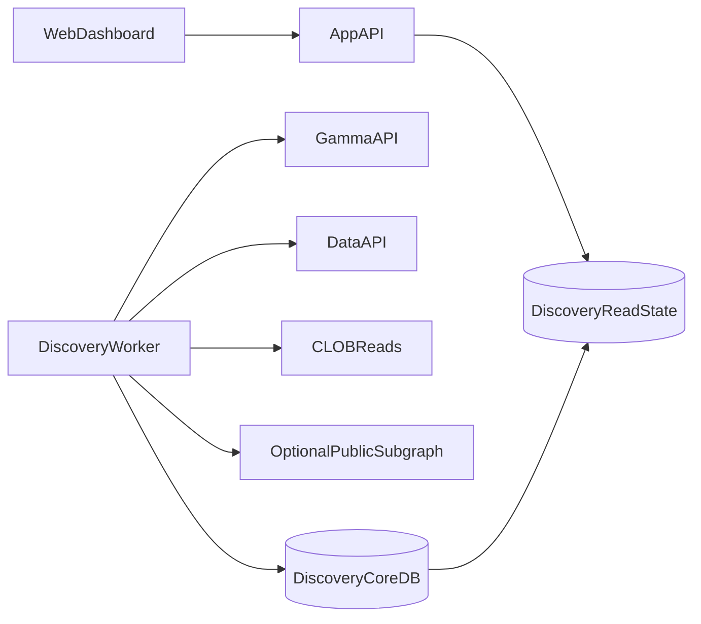
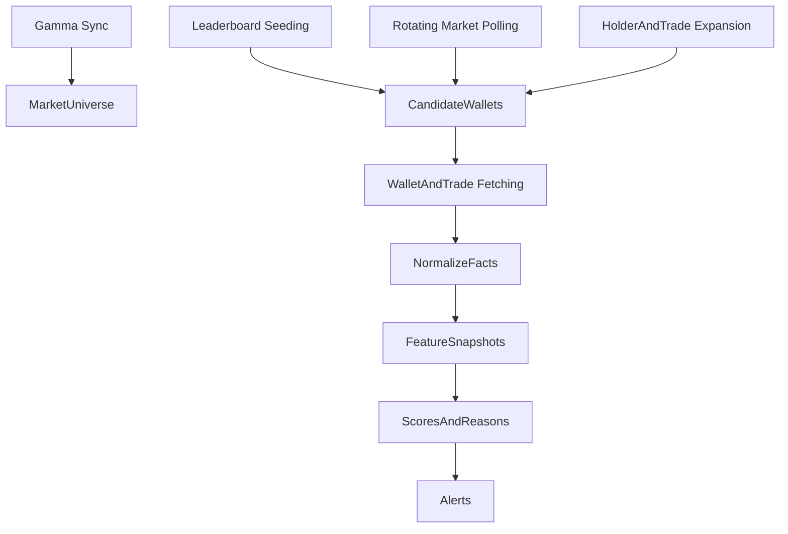

# Discovery Data Architecture Spec

**Date:** 2026-04-14  
**Parent plan:** `docs/plans/2026-04-14-discovery-platform-master-plan.md`  
**Purpose:** Define the runtime topology, data flows, storage model, and infrastructure posture for the rebuilt discovery platform.

---

## 1. Goal

Design a discovery architecture that is:

- nearly free to operate by default,
- clear about what process owns what,
- resilient enough for a first-class product,
- capable of trustworthy ranking and evaluation,
- extensible without becoming overbuilt.

---

## 2. Current Problem

The current repo effectively contains overlapping discovery architectures:

- a trade-driven `DiscoveryManager` path,
- a wallet-seed `DiscoveryWorkerRuntime` path,
- an older HTTP-oriented worker path,
- one shared database with overlapping but semantically different tables.

This makes it hard to know:

- what the source of truth is,
- what data the UI is actually showing,
- which worker should be considered production,
- how to migrate safely.

---

## 3. Architecture Principles

### Principle 1: One authoritative discovery runtime

There should be one worker model that owns ingestion, features, scores, and alerts.

### Principle 2: Read/write separation

The app server should serve APIs and UI. The discovery worker should compute state.

### Principle 3: Cheap breadth first

Use official public Polymarket data and low-cost storage before any expensive chain or social infrastructure.

### Principle 4: Point-in-time facts should be preserved

The storage model must make later evaluation possible.

### Principle 5: Additive migration, not hard cutover

The new system should coexist safely long enough to validate and switch.

---

## 4. Runtime Topology

## 4.1 Recommended topology

## 4.2 Roles

### App server

- serve discovery APIs,
- serve UI,
- read authoritative discovery state,
- accept user actions like watch, dismiss, or track.

### Discovery worker

- build market universe,
- seed wallets,
- ingest and normalize facts,
- compute features,
- compute scores,
- generate reasons,
- generate alerts,
- write evaluation and cost telemetry.

## 4.3 Explicit non-goals

- the app server should not also run discovery scoring logic,
- multiple discovery runtimes should not write conflicting score state,
- “passive” and “worker” modes should not mean different truths in production.

---

## 5. Data Sources

## 5.1 Source priority

| Tier | Source | Purpose |
|---|---|---|
| Core | Gamma API | market/event universe |
| Core | Data API | wallet/trade/activity/leaderboard |
| Core | CLOB read path | liquidity, spread, price context |
| Optional | public subgraph | corroboration and deeper backfill |
| Fallback | raw Polygon/RPC | only where strictly needed |

## 5.2 Why this order

- It keeps the core cheap.
- It keeps the architecture aligned with Polymarket-native surfaces.
- It minimizes custom chain-indexing burden.

---

## 6. Ingestion Flow

## 6.1 Top-level flow

## 6.2 Stages

### Stage 1: Universe builder

Build and refresh:

- active markets,
- event metadata,
- tags,
- token mappings,
- resolution metadata when available.

### Stage 2: Seed engine

Build wallet candidates from:

- official leaderboard slices,
- rotating high-interest markets,
- holders and active-wallet expansions,
- repeated high-value or high-signal appearances.

### Stage 3: Fact ingestion

For seeded wallets and chosen market slices, ingest:

- trade facts,
- activity facts,
- positions context,
- liquidity context,
- market context.

### Stage 4: Derived state

Compute:

- wallet features,
- strategy class,
- scores,
- reasons,
- alerts,
- evaluation snapshots.

---

## 7. Storage Model

## 7.1 Core storage layers

| Layer | Purpose |
|---|---|
| Canonical facts | immutable-ish point-in-time records |
| Derived snapshots | reusable feature and score state |
| User state | watchlist, dismissals, track state |
| Evaluation state | historical model effectiveness |
| Cost telemetry | request and runtime accounting |

## 7.2 Proposed v2 entities

### `discovery_market_universe_v2`

Stores:

- condition id,
- event id,
- token ids,
- slug,
- category,
- lifecycle metadata,
- liquidity and volume metadata snapshots.

### `discovery_wallet_candidates_v2`

Stores:

- wallet address,
- first-seen time,
- latest-seen time,
- candidate source,
- source metric,
- promotion status.

### `discovery_trade_facts_v2`

Stores:

- trade identity,
- wallet attribution,
- market identity,
- token/outcome identity,
- side,
- size,
- price,
- timestamp,
- source,
- normalization provenance.

### `discovery_wallet_features_v2`

Stores:

- per-wallet computed features by snapshot time,
- feature version,
- confidence inputs,
- feature-family rollups.

### `discovery_wallet_scores_v2`

Stores:

- strategy class,
- discovery score,
- trust score,
- copyability score,
- confidence,
- surface bucket,
- score version.

### `discovery_wallet_reasons_v2`

Stores:

- primary reason,
- supporting reasons,
- caution flags,
- reason code metadata.

### `discovery_alerts_v2`

Stores:

- alert type,
- severity,
- wallet,
- market if relevant,
- reason linkage,
- dismissal or mute state.

### `discovery_eval_snapshots_v2`

Stores:

- evaluation window,
- ranking output snapshots,
- later outcomes,
- metric summaries.

### `discovery_cost_snapshots_v2`

Stores:

- request counts by provider and endpoint,
- estimated provider cost,
- runtime duration,
- coverage counts,
- polling load.

---

## 8. Read Model vs Write Model

## 8.1 Write model

The worker writes canonical and derived state.

## 8.2 Read model

The app reads pre-computed DTO-friendly rows, either:

- directly from v2 score and reason tables,
- or through a light projection layer.

### Recommendation

Create a narrow read model rather than letting UI routes reconstruct meaning from many tables on every request.

---

## 9. API Contract Layer

The discovery API should consume a stable DTO layer rather than exposing internal schema shape.

## Recommended response object

Each surfaced wallet should include:

- identity,
- strategy class,
- discovery/trust/copyability/confidence,
- reason payload,
- caution flags,
- freshness,
- actions available.

This prevents the UI from depending on legacy table semantics like:

- `whale_score` meaning one thing in storage and another in routes,
- `volume7d` meaning seeded volume in one path and aggregated wallet volume in another.

---

## 10. Evaluation and Historical Truth

## 10.1 Why architecture must support evaluation

If the storage model only preserves “current truth,” then later evaluation will be contaminated by hindsight.

## 10.2 Architectural requirement

The system must preserve enough point-in-time state to reconstruct:

- what the model knew,
- what it surfaced,
- what happened next.

That is why evaluation snapshots are first-class entities, not an afterthought.

---

## 11. Cost and Infra Strategy

## 11.1 Baseline posture

| Component | Baseline choice |
|---|---|
| Worker process | one small dedicated worker |
| Database | SQLite or small managed relational DB |
| Cache | optional, only if needed |
| Providers | public Polymarket APIs first |
| Chain access | avoid central reliance |

## 11.2 When to upgrade

| Trigger | Possible upgrade |
|---|---|
| request pressure too high | stronger cache / smarter scheduling |
| history too deep for API-only path | more subgraph usage |
| UI load grows | read projection / cache |
| provider throttling becomes painful | selective paid infra |

## 11.3 Rule

No infra upgrade should be added without:

- expected monthly cost,
- expected lift,
- rollback path.

---

## 12. Migration Strategy

## 12.1 Phased migration

1. introduce v2 schema,
2. build v2 worker writes,
3. compare v1 and v2 read outputs,
4. switch API contracts,
5. retire or archive v1-specific state.

## 12.2 Safety requirements

- no destructive cutover before read parity checks,
- no API contract switch without UI alignment,
- no deleting old tables until evaluation confirms v2 is superior or equivalent.

---

## 13. Operational Concerns

## 13.1 Logging

Discovery worker output should be structured and consistent with the app’s logging standards.

## 13.2 Health

The system should report:

- last successful sync time,
- last successful score run,
- last successful alert run,
- provider freshness,
- coverage summary.

## 13.3 Failure behavior

When provider calls fail:

- degrade freshness,
- lower confidence,
- avoid pretending the data is fresh,
- do not fabricate stable scores from stale inputs.

---

## 14. Risks

| Risk | Mitigation |
|---|---|
| schema sprawl | keep strict v2 entities and DTO boundaries |
| runtime duplication | one worker owner, explicit startup scripts |
| API/UI semantic drift | versioned contracts |
| hidden provider costs | cost telemetry table |
| stale data looking fresh | explicit freshness tracking |

---

## 15. Final Recommendation

The rebuilt discovery architecture should be a **single-worker, public-data-first, point-in-time-preserving system** with:

- one authoritative write path,
- stable read projections,
- versioned schema,
- additive migration,
- visible cost telemetry.

That gives the project the best chance of becoming both trustworthy and affordable.
