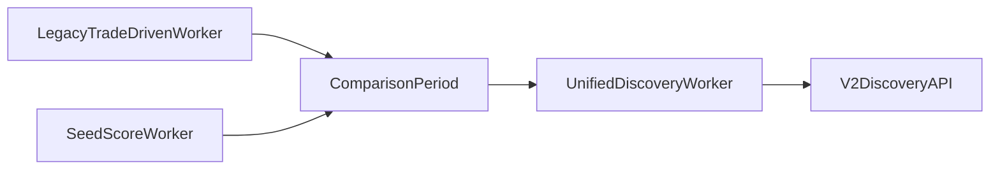

# Discovery Migration Plan

**Date:** 2026-04-14  
**Parent plan:** `docs/plans/2026-04-14-discovery-platform-master-plan.md`  
**Purpose:** Define how to move from the current discovery system to the rebuilt platform safely and incrementally.

---

## 1. Goal

Migrate from the current split discovery implementation to a single authoritative discovery platform without:

- breaking the app,
- silently changing meaning in the UI,
- losing historical evidence,
- creating contradictory worker behavior,
- forcing a risky big-bang cutover.

---

## 2. Current Migration Problem

The current discovery system has overlapping runtime and schema semantics:

- multiple discovery entry points,
- multiple score meanings,
- multiple table families,
- UI and API logic that implicitly reinterpret raw fields.

That means migration is not just data movement. It is also:

- contract cleanup,
- runtime cleanup,
- semantic cleanup,
- operational cleanup.

---

## 3. Migration Principles

### Principle 1: Additive first

Introduce v2 structures before removing v1 behavior.

### Principle 2: One truth at a time

Do not let two systems claim authority over the same score semantics for longer than necessary.

### Principle 3: Preserve evidence

Historical records useful for evaluation and debugging should be retained long enough to validate the new system.

### Principle 4: Switch contracts deliberately

The UI should move to explicit v2 DTOs, not infer v2 meaning from old columns.

### Principle 5: Validate before retirement

Retire v1 only after:

- runtime stability,
- API parity,
- evaluation confidence,
- UI signoff.

---

## 4. Migration Targets

## 4.1 Runtime target

Replace multiple discovery execution paths with one authoritative worker model.

## 4.2 Schema target

Introduce versioned v2 discovery entities for:

- canonical facts,
- features,
- scores,
- reasons,
- alerts,
- evaluation,
- costs.

## 4.3 API target

Move to explicit v2 response shapes for discovery routes.

## 4.4 UI target

Move discovery UI to consume v2 semantics only.

---

## 5. Migration Phases

## Phase 0: Prep and Freeze

### Goal

Reduce ambiguity before building the new system.

### Tasks

- document current discovery entry points,
- identify production runtime of record,
- freeze current discovery field meanings,
- identify all API/UI fields that depend on legacy semantics,
- stop adding new behavior to the old discovery model.

### Output

- clear map of current runtime,
- clear map of field meanings,
- migration checklist.

---

## Phase 1: Introduce v2 Contracts

### Goal

Define v2 without changing what users see yet.

### Tasks

- add v2 schema entities,
- add v2 worker modules behind flags,
- define versioned DTOs,
- add adapters for reading v1 and v2 side by side,
- preserve current route shapes until cutover.

### Important rule

No user-visible discovery route should depend on half-migrated schema interpretation.

---

## Phase 2: Dual Build, Single Read

### Goal

Run the new worker and schema in parallel while the UI still reads the old path.

### Tasks

- populate v2 market universe,
- populate v2 candidate and fact tables,
- compute v2 features and scores,
- log v1 vs v2 comparison snapshots,
- detect semantic mismatches early.

### Why this matters

It allows:

- comparison,
- debugging,
- confidence building,
- evaluation before user-visible switch.

---

## Phase 3: Dual Read in Internal or Flagged Mode

### Goal

Expose v2 results to internal review without changing the public default.

### Tasks

- add a feature flag or internal-only switch,
- show v2 score stack and reasons,
- compare old and new surfaced wallets,
- validate UI comprehension,
- validate API contracts.

### Review focus

- does v2 feel more trustworthy?
- do reasons feel more coherent?
- are strategy classes understandable?
- are surfaced wallets better?

---

## Phase 4: Cut API Over to v2

### Goal

Make v2 the authoritative API path.

### Tasks

- switch route handlers to v2 DTOs,
- keep compatibility adapters only where necessary,
- update UI to consume v2 semantics directly,
- remove UI dependence on legacy raw fields.

### Important requirement

This step should happen only after field naming and meaning are stable.

---

## Phase 5: Retire or Archive v1

### Goal

Remove old ambiguity and reduce maintenance cost.

### Tasks

- stop v1 writes,
- archive v1 tables or keep read-only snapshots,
- remove dead worker paths,
- simplify startup scripts,
- clean old helper logic from routes and UI.

### Retirement condition

Do not retire until:

- v2 has stable runtime behavior,
- v2 APIs are validated,
- v2 evaluation beats or reasonably matches v1 baseline where appropriate,
- operations are simpler, not more confusing.

---

## 6. Runtime Migration

## 6.1 Current runtime problem

The repo currently has multiple discovery-related paths with overlapping purpose.

## 6.2 Target runtime rule

Only one worker path should:

- ingest,
- compute,
- write scores,
- write alerts.

## 6.3 Runtime migration steps

1. identify the worker of record,
2. make all other discovery worker paths explicitly deprecated or inactive,
3. update startup scripts,
4. update deployment scripts,
5. add health visibility for the one official path.

### Runtime migration diagram

---

## 7. Schema Migration

## 7.1 Strategy

Add v2 tables rather than mutating old tables in place immediately.

## 7.2 Why

This preserves:

- debuggability,
- historical comparison,
- rollback ability,
- controlled cutover.

## 7.3 Recommended rules

- keep v2 names explicit,
- version score outputs,
- keep reason payloads structured,
- track source provenance,
- preserve snapshot timestamps.

---

## 8. API Migration

## 8.1 Core problem

Current UI/API behavior sometimes depends on implicit remapping, such as a field meaning one thing in storage and another in responses.

## 8.2 API migration strategy

### Step 1

Define explicit response contracts for:

- discovery feed rows,
- leaderboard rows,
- wallet profile,
- alerts.

### Step 2

Support old and new route plumbing under internal flags.

### Step 3

Switch the UI to the new contracts.

### Step 4

Delete compatibility interpretation logic.

---

## 9. UI Migration

## 9.1 UI migration order

1. discovery feed
2. wallet profile
3. leaderboard
4. compare
5. watchlist and alerts

## 9.2 Why this order

The discovery feed is the highest-value and most explanation-driven surface, so it should move first once v2 semantics are stable.

## 9.3 UI migration rule

No UI surface should mix old and new score semantics in the same row or page.

---

## 10. Evaluation Migration

## 10.1 Requirement

Before full cutover, the system should be able to answer:

- how does v2 differ from v1?
- are the surfaced wallets better?
- are alerts more useful?
- is confidence better calibrated?

## 10.2 Comparison set

| Dimension | Compare |
|---|---|
| surfaced-wallet overlap | old vs new |
| precision@k | old vs new |
| trust behavior | old vs new |
| alert usefulness | old vs new |
| cost | old vs new |

---

## 11. Rollback Strategy

## 11.1 Rollback requirement

The migration must be reversible at each user-visible phase.

## 11.2 Rollback methods

| Phase | Rollback method |
|---|---|
| dual-build | disable v2 writes |
| internal-flag read | turn off flag |
| API cutover | switch routes back to v1 adapter |
| UI cutover | restore old discovery tab behavior temporarily |

## 11.3 Important note

Rollback is easiest if v1 is not deleted too early.

---

## 12. Risks

| Risk | Mitigation |
|---|---|
| conflicting workers during migration | one worker of record, explicit startup cleanup |
| confusing score parity | versioned DTOs and explicit naming |
| data drift between v1 and v2 | comparison snapshots and review period |
| UI regressions | move surfaces one at a time |
| incomplete cleanup | explicit retirement checklist |

---

## 13. Retirement Checklist

Retire v1 only when all of the following are true:

- v2 worker is stable in production-like conditions,
- v2 discovery routes are the default,
- UI reads only v2 semantics,
- evaluation confirms v2 is materially better or safer,
- startup and deploy scripts reference only the unified worker,
- legacy ambiguity is removed from docs.

---

## 14. Final Recommendation

Treat migration as a product program, not a cleanup chore.

The safest path is:

1. prep and freeze,
2. add v2,
3. dual-build,
4. internal compare,
5. cut API and UI over,
6. retire v1 deliberately.

That sequence gives the rebuild the best chance of succeeding without causing a trust-destroying transition period.
