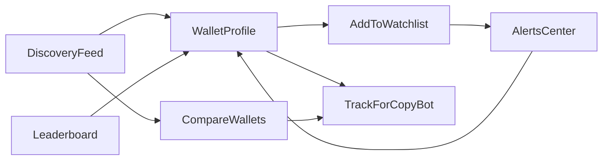
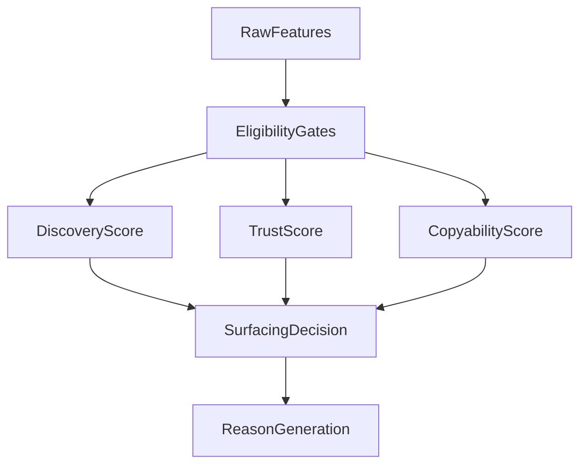
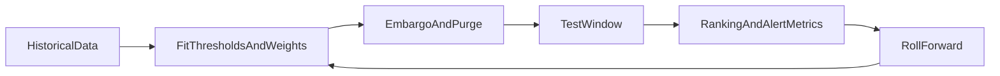
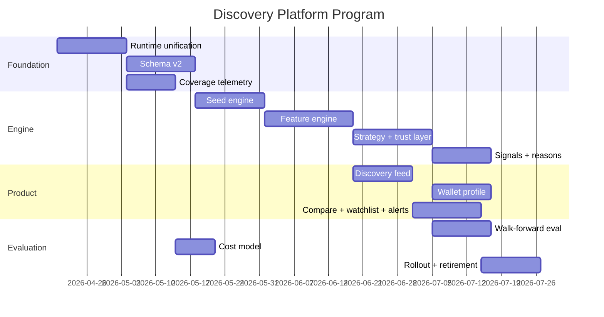

# Discovery Platform Master Plan

**Date:** 2026-04-14  
**Status:** Research complete, planning active  
**Priority:** Highest product priority after copy-trading stability  
**Scope:** Polymarket-native discovery platform, nearly-free core architecture, trustworthy wallet ranking, explainable UI, evaluation framework, migration path  
**Companion research:** `docs/research/2026-04-14-discovery-platform-research-report.md`  
**Companion specs:**  
- `docs/plans/2026-04-14-discovery-ranking-model-spec.md`  
- `docs/plans/2026-04-14-discovery-data-architecture-spec.md`  
- `docs/plans/2026-04-14-discovery-ui-spec.md`  
- `docs/plans/2026-04-14-discovery-migration-plan.md`

---

## 1. Executive Summary

The next major product leap is not better trade copying. It is **better trader discovery**.

Today the bot can copy a wallet once the user already knows who to follow. That means the app is strongest at the **last mile** and weakest at the **first mile**. The discovery system should fix that by answering:

- Who is worth following before they are obvious?
- Which wallets are truly trustworthy versus just lucky, noisy, manipulative, or uncopyable?
- Why did a wallet surface?
- How sure are we?
- Can we do this **nearly free** without recreating the expensive Alchemy-heavy architecture that previously hurt trust?

The core recommendation from research is clear:

1. Build a **Polymarket-native discovery service first**, not a broad social or multi-chain intelligence product.
2. Use **official Polymarket public data surfaces** and low-cost supporting infrastructure as the core data plane.
3. Stop treating discovery as a single leaderboard. Split it into:
   - **Discovery**: who is emerging early
   - **Trust**: who is statistically and behaviorally credible
   - **Copyability**: who a follower can realistically mirror
   - **Strategy class**: what kind of wallet this is
4. Separate **point-in-time** signals from hindsight outcomes so the system does not accidentally “discover” wallets using future information.
5. Build explanation and evaluation into the platform from day one.

The right end state is a **first-class discovery platform inside the app**:

- discovery feed
- wallet profile pages
- trust/reason system
- watchlists
- alerts
- one-click promote-to-track
- walk-forward evaluation
- cost telemetry

---

## 2. Product Thesis

### The core job to be done

Users do not actually want “analytics.” They want to:

1. find a wallet early,
2. believe it is worth following,
3. understand why,
4. act quickly.

### The product wedge

Most existing products do one of these things:

- show raw leaderboard stats,
- show whale alerts,
- show wallet pages,
- offer copy trading,
- show market dashboards.

Very few combine all of these into one trustworthy workflow:

**discover -> vet -> watch -> copy**

That workflow is the wedge.

### Why this matters more than more copy-trading work

Copying known wallets is table stakes. Discovery creates the upstream edge:

- it increases user value without requiring users to bring their own wallet list,
- it creates more defensible product differentiation,
- it compounds over time because the system gets better as historical evaluation improves.

---

## 3. The Current State

### What works

- The app already has a real copy-trading engine.
- The repo already contains a substantial discovery codebase:
  - `src/discovery/discoveryManager.ts`
  - `src/discovery/discoveryWorker.ts`
  - `src/discovery/signalEngine.ts`
  - `src/discovery/discoveryScorer.ts`
  - `src/discovery/copyabilityScorer.ts`
  - `src/discovery/earlyEntryScorer.ts`
  - `src/discovery/statsStore.ts`
- There are already tests and schemas that make a rebuild feasible without starting from zero.

### What is broken

- There are effectively **two discovery systems** living in one codebase.
- The dashboard is wired more to the wallet-seed/control-plane path than the trade-driven path.
- Ranking logic is split and semantically inconsistent.
- Some signal logic exists but is not meaningfully live in the intended path.
- Several metrics silently mean different things in different tables.
- The system does not currently justify user trust.

### The most important repo-level finding

The current system is not just under-tuned. It is architecturally split.

That means the right path is **rebuild and unify**, not “keep tweaking thresholds.”

---

## 4. Research Summary

## 4.1 Competitive Landscape

### Product categories

| Category | What it does | Examples |
|---|---|---|
| Venue-native leaderboards | Show top traders and basic ranking stats | Polymarket leaderboard |
| Analytics terminals | Search wallets, positions, traders, markets | Polymarket Analytics, Hashdive |
| Whale trackers | Alert on large activity | Polywhaler, browser extensions, Telegram bots |
| Copy-trading tools | Mirror trades from chosen wallets | PredictionSync, open-source copy bots |
| Smart-money platforms | Tag and rank high-signal actors across crypto | Nansen, Arkham |
| SQL/research dashboards | Build flexible analysis layers | Dune dashboards |

### What competitors do well

- make wallet browsing easy,
- show ranks and filters,
- provide alerts,
- provide trader pages,
- give users a way to build watchlists,
- sometimes provide “smart score” or “whale score” style shortcuts.

### What competitors do poorly

- they often optimize for **visibility**, not **truth**,
- they rarely explain **copyability**,
- they often collapse different wallet types into one ranking,
- they often show data without a strong decision layer,
- many of the most aggressive products are hard to trust.

### Strategic opening

The biggest opening is a discovery platform that is:

- Polymarket-native,
- trust-first,
- copyability-aware,
- explainable,
- low-cost,
- integrated into a working copy-trading product.

---

## 4.2 Research on Data Sources

### Official Polymarket data planes

| Surface | Best use | Strength | Weakness |
|---|---|---|---|
| Gamma API | market universe, tags, metadata, slugs, events | public, structured, cheap | not enough for wallet discovery by itself |
| Data API | trades, activity, positions, holders, leaderboard | public, wallet-centric, powerful | pagination/rate limits constrain brute-force scans |
| CLOB REST + WS | books, midpoints, price history, trade freshness | great for microstructure and copyability | does not directly solve all-wallet discovery |
| Public subgraphs | historical and on-chain corroboration | useful for backfills and analytics | extra complexity and possible lag |

### Cost conclusion

The nearly-free core is realistic **if** the architecture is disciplined:

- use public Polymarket APIs first,
- use public subgraphs selectively,
- avoid raw chain log scanning as the center of the system,
- use small workers and aggressive caching,
- measure request volume early.

### What becomes expensive first

1. brute-force raw chain scanning,
2. high-frequency polling without a seeded universe,
3. expensive RPC usage,
4. trying to ingest all off-platform social signals.

---

## 4.3 Research on Trader Quality

### Key finding

High PnL is not the same as high information value.

A wallet may be profitable because it is:

- genuinely informative,
- a structural arbitrageur,
- a market maker,
- lucky,
- manipulative,
- benefiting from an uncopyable execution edge.

### Implication

Discovery must score **types of quality**, not just one quality.

### Wallet quality dimensions

| Dimension | Meaning | Why it matters |
|---|---|---|
| Discovery | emerging early, worth watching | core “find them before everyone else” goal |
| Trust | statistically and behaviorally credible | avoids luck/noise/manipulation |
| Copyability | realistically mirrorable by the user | ties discovery to actual product value |
| Strategy class | what kind of actor this is | avoids mixing arb/MM/directional wallets |
| Explanation | why the system surfaced them | required for user trust |

---

## 4.4 Research on Market Microstructure

### Important lessons

- Order flow matters more than vanity metrics.
- Timing relative to public information matters.
- Some manipulative behavior gets corrected, some persists.
- Structural arbitrage can look brilliant without being “forecasting skill.”
- Volume can be misleading without anti-wash and anti-loop logic.

### Product implication

The system should reward:

- point-in-time informational behavior,
- repeated category-specific quality,
- durable track record,
- practical copyability.

It should penalize:

- tiny-sample spikes,
- suspicious round-trip or loop behavior,
- structurally uncopyable strategies,
- low-integrity flow.

---

## 4.5 Research on UX Patterns

### Strong recurring patterns

- table for dense leaderboard browsing,
- cards for scan-friendly discovery feed,
- profile page for deeper trust decisions,
- compare view for side-by-side judgment,
- watchlist and alerts as retention loops,
- reasons/badges/explanations for trust,
- methodology page for transparency.

### UX conclusion

The discovery UX should not be one giant table.

It should have distinct surfaces:

1. **Discovery feed**
2. **Leaderboard**
3. **Wallet profile**
4. **Compare**
5. **Watchlist**
6. **Alerts center**
7. **Methodology**

---

## 5. Product Vision

## 5.1 Core Product Surfaces

### A. Discovery Feed

The “what should I look at right now?” page.

Primary jobs:

- surface emerging wallets,
- explain why they matter,
- show trust and copyability at a glance,
- let the user watch or track them quickly.

### B. Leaderboard

The “show me ranked traders” page.

Primary jobs:

- let users sort/filter dense results,
- separate established and emerging,
- avoid raw-PnL tunnel vision.

### C. Wallet Profile

The “should I trust this wallet?” page.

Primary jobs:

- tell the wallet’s story,
- show strategy type,
- show track record,
- show behavior,
- show risk.

### D. Compare

The “which of these wallets is better for me?” page.

Primary jobs:

- compare 2-4 wallets,
- highlight differences,
- avoid forcing users to remember data across pages.

### E. Watchlist + Alerts

The “keep me up to date” layer.

Primary jobs:

- save wallets,
- get notified on meaningful change,
- avoid spam.

---

## 5.2 Primary User Flows



### Main flow

1. User opens discovery feed.
2. User sees wallets with reasons and trust markers.
3. User opens a wallet profile.
4. User either:
   - adds it to watchlist,
   - promotes it to tracked/copyable,
   - dismisses it.

### Secondary flow

1. User receives alert.
2. User lands on wallet or market context.
3. User decides whether to watch or copy.

---

## 5.3 Product Taxonomy

### Wallet buckets

| Bucket | Meaning |
|---|---|
| Emerging | short history, high recent promise |
| Established | long enough history to trust more |
| Copyable | likely actionable for followers |
| Structural/Arb | useful, but not the same as forecasting skill |
| Suspicious | noteworthy, but should be treated carefully |

### Score buckets

| Score | Purpose |
|---|---|
| Discovery score | should this wallet surface? |
| Trust score | how credible is the wallet? |
| Copyability score | can a normal user follow it well? |
| Confidence | how much evidence is behind the judgment? |

---

## 6. Reference Architecture

## 6.1 System Architecture

```mermaid
flowchart LR
    gamma[GammaAPI] --> universe[UniverseBuilder]
    dataApi[DataAPI] --> seed[WalletSeedEngine]
    clob[CLOBReadsAndStreams] --> ingest[IngestionLayer]
    subgraph[PublicSubgraphOptional] --> ingest
    universe --> ingest
    seed --> ingest
    ingest --> facts[NormalizedPointInTimeFacts]
    facts --> features[FeatureEngine]
    features --> classify[StrategyClassifier]
    features --> trust[TrustEngine]
    features --> copyability[CopyabilityEngine]
    classify --> rank[RankingEngine]
    trust --> rank
    copyability --> rank
    rank --> reasons[ReasonComposer]
    rank --> alerts[AlertEngine]
    reasons --> api[DiscoveryAPI]
    alerts --> api
    api --> ui[DiscoveryUI]
    rank --> evaluation[EvaluationEngine]
    evaluation --> cost[CostTelemetry]
```

## 6.2 Runtime Model

### Recommended runtime split

- **App runtime**:
  - serves UI
  - serves discovery APIs
  - reads authoritative discovery state
- **Discovery worker runtime**:
  - runs ingestion
  - computes features
  - computes scores
  - generates reasons and alerts
  - records evaluation/cost telemetry

### Important design rule

There should be **one authoritative discovery worker model**, not multiple overlapping engines writing different truths.

---

## 6.3 Data Model

### Current problem

The existing schema mixes:

- trade-driven legacy state,
- wallet-seed pipeline state,
- inconsistent metrics,
- ambiguous API meanings.

### Recommended v2 entities

| Entity | Purpose |
|---|---|
| `discovery_market_universe_v2` | canonical market/event metadata |
| `discovery_trade_facts_v2` | normalized point-in-time trade facts |
| `discovery_wallet_candidates_v2` | seed provenance and promotion path |
| `discovery_wallet_features_v2` | computed feature snapshots |
| `discovery_wallet_scores_v2` | authoritative score outputs |
| `discovery_wallet_reasons_v2` | explanation payloads |
| `discovery_alerts_v2` | alert records and dismiss state |
| `discovery_eval_snapshots_v2` | walk-forward evaluation artifacts |
| `discovery_cost_snapshots_v2` | request, provider, and runtime cost telemetry |

### Storage rule

Keep the rebuilt schema versioned and additive during migration rather than mutating the old discovery tables in place too early.

---

## 7. Scoring Model

## 7.1 Strategy Classification First

Before scoring a wallet as “good,” classify what kind of wallet it is.

### Strategy classes

| Class | Interpretation | Default treatment |
|---|---|---|
| Informational directional | likely valuable forecasting behavior | high discovery value |
| Structural arbitrage | profitable but structurally different | separate bucket |
| Market maker / rebate oriented | may have edge but poor copyability | not default copy target |
| Reactive momentum | useful but less early | medium discovery value |
| Suspicious / wash-prone | low integrity | suppress |

## 7.2 Score Stack



### Eligibility gates

- minimum sample size,
- minimum distinct markets,
- minimum observation window,
- no severe suspicion flags.

### Discovery score

Optimized for “should this wallet surface now?”

### Trust score

Optimized for “how much should I believe this wallet is real and durable?”

### Copyability score

Optimized for “how likely is a follower to get similar enough execution?”

### Confidence

Optimized for “how much evidence supports these scores?”

---

## 7.3 Feature Families

| Family | Examples |
|---|---|
| Early-entry | entered before crowded attention, entered before broad flow |
| Category focus | consistently strong in a category, not random dabbling |
| Conviction | meaningful concentration rather than scattershot bets |
| Timing quality | repeated good timing, not isolated wins |
| Cohort behavior | leads cohorts instead of only following them |
| Market selection | chooses markets where edge appears to matter |
| Integrity | low wash risk, low loop behavior, plausible economics |
| Copyability | reasonable size, liquidity fit, follower-friendly pattern |

### Important principle

Not all features should be used in the same way.

| Feature type | Use |
|---|---|
| Point-in-time feature | can drive rank at time `t` |
| Lagging validation feature | cannot drive early rank, but can validate trust |
| Explanation feature | helps users understand but should not dominate rank |

---

## 8. Evaluation Framework

## 8.1 Non-Negotiable Rule

The system must not be allowed to cheat.

### Point-in-time rule

At any evaluation timestamp, the system may only use information knowable at that time.

### Why this matters

Without this, discovery becomes hindsight theater.

## 8.2 Evaluation Stack

| Method | Purpose |
|---|---|
| Walk-forward evaluation | simulate live operation across time |
| Precision@K | are the top surfaced wallets actually useful? |
| MAP / NDCG | how good is overall ranking quality? |
| Alert precision@K per day | are alerts useful under human attention limits? |
| Cohort-relative baseline | is this better than random among comparable wallets? |
| Small-sample suppression | avoid fake winners |
| Cost-per-signal reporting | is the system efficient to operate? |

## 8.3 Evaluation Flow



### Success condition

The system should beat:

- current-system baseline,
- random eligible-wallet baseline,
- naive leaderboard-following baseline.

---

## 9. Cost Model

## 9.1 Core Philosophy

The baseline product should be nearly free to operate from a data-provider perspective.

### Free-first baseline

| Layer | Planned default |
|---|---|
| Market metadata | Gamma API |
| Wallet/trade/activity | Data API |
| Microstructure | selective CLOB read path |
| Backfill/corroboration | public subgraph where needed |
| Storage | local SQLite or low-cost managed DB |
| Worker runtime | one small worker process |

## 9.2 Cost Tiers

| Tier | Description | Target use |
|---|---|
| Tier 0 | fully public data, one worker, local/cheap storage | core product |
| Tier 1 | optional subgraph or low-cost infra upgrades | scale and safety |
| Tier 2 | optional paid data/RPC enhancement | only if lift is proven |

## 9.3 Cost Telemetry

The system should log:

- requests by provider,
- requests by endpoint,
- polling frequency,
- backfill volume,
- runtime duration,
- monthly estimated provider cost under current behavior.

### Rule

No optional paid upgrade should be adopted without:

1. cost forecast,
2. expected lift hypothesis,
3. measured post-rollout comparison.

---

## 10. Migration Plan

## 10.1 Migration Goals

- unify discovery runtime,
- preserve current app stability,
- avoid losing useful historical data,
- reduce semantic confusion,
- keep the UI functioning while v2 is built.

## 10.2 Migration Sequence

1. define v2 contracts,
2. dual-write or dual-build new discovery state,
3. read v2 behind feature flag,
4. switch UI/API to v2,
5. retire v1 discovery semantics.

## 10.3 Migration Risks

| Risk | Why it matters | Mitigation |
|---|---|---|
| split score confusion | current UI may show one score while another is stored | versioned DTOs |
| multiple worker overlap | can create contradictory writes | one runtime owner |
| old semantics leaking into v2 | can poison trust | characterization tests first |
| schema churn | can break existing tests/UI | additive migration strategy |

---

## 11. Recommended Phases

## Phase 1: Foundation

### Goal

Create one authoritative discovery runtime and one authoritative data model.

### Deliverables

- runtime decision
- v2 schema
- migration scaffolding
- coverage telemetry

## Phase 2: Discovery Engine

### Goal

Build real seeding, features, strategy classification, trust scoring, and copyability scoring.

### Deliverables

- seed engine
- feature engine
- strategy classifier
- score engine
- reasons payload

## Phase 3: Product Layer

### Goal

Expose discovery as an actual product, not an internal dataset.

### Deliverables

- discovery feed
- leaderboard
- profile page
- compare
- watchlist
- alerts center

## Phase 4: Evaluation and Hardening

### Goal

Prove the system works and can scale.

### Deliverables

- walk-forward evaluation
- precision@k reporting
- baseline comparison
- cost dashboard
- rollout and retirement of old path

---

## 12. Mockups

## 12.1 Discovery Feed

```text
+----------------------------------------------------------------------------------+
| Discovery                                                                        |
| Filters: [Emerging v] [Politics v] [7d v] [Copyable only] [High trust]          |
+----------------------------------------------------------------------------------+
| Wallet            Strategy      Discovery  Trust  Copyability  Why it surfaced   |
| 0xA1...9F         Early         86         72     81           Early entry +      |
|                                                         category focus + repeat   |
|                                                         timing quality            |
| [View] [Watch] [Track]                                                         |
+----------------------------------------------------------------------------------+
| Wallet            Strategy      Discovery  Trust  Copyability  Why it surfaced   |
| 0xBC...21         Arb           79         88     34           Structural edge +  |
|                                                         repeated parity capture   |
| [View] [Watch]                                                               |
+----------------------------------------------------------------------------------+
```

## 12.2 Wallet Profile

```text
+----------------------------------------------------------------------------------+
| Wallet: 0xA1...9F                 Strategy: Informational directional            |
| Confidence: Medium                First seen: 31 days ago                        |
| Discovery 86  Trust 72  Copyability 81                                           |
+----------------------------------------------------------------------------------+
| Why this wallet matters                                                         |
| - Entered 4 politics markets before broad volume acceleration                   |
| - Strong concentration in one category                                          |
| - Above-cohort timing quality over 30d                                          |
| - Low suspicion flags                                                           |
+----------------------------------------------------------------------------------+
| Performance             | Behavior                | Copyability                  |
| 7d / 30d / 90d          | Hold time, bet size     | Liquidity fit, entry size    |
| Drawdown                | Concentration           | Follower slippage estimate    |
+----------------------------------------------------------------------------------+
| Recent markets, recent trades, cohort overlaps, alerts, watchlist controls      |
+----------------------------------------------------------------------------------+
```

## 12.3 Compare View

```text
+----------------------------------------------------------------------------------+
| Compare Wallets                                                                  |
+----------------------------------------------------------------------------------+
| Attribute            | Wallet A          | Wallet B          | Wallet C          |
| Strategy             | Informational     | Arb               | Momentum          |
| Discovery            | 86                | 79                | 68                |
| Trust                | 72                | 88                | 54                |
| Copyability          | 81                | 34                | 63                |
| Category Focus       | Politics          | Multi             | Crypto            |
| Best fit             | Copy candidate    | Watch only        | Conditional       |
+----------------------------------------------------------------------------------+
```

---

## 13. Visual Roadmap



---

## 14. Decision Summary

| Decision | Recommendation |
|---|---|
| Discovery scope | discovery-first, tabs/settings later |
| Data scope | Polymarket-native first |
| Cost posture | nearly-free core, optional paid later only with cost forecast |
| Runtime topology | one authoritative worker model |
| Ranking model | layered score stack, not one score |
| UX model | feed + leaderboard + profile + compare + watchlist + alerts |
| Evaluation model | point-in-time, walk-forward, precision@k, cohort-relative |
| Social/X signals | optional future enrichment only |

---

## 15. What Not To Do

- do not keep two discovery systems alive indefinitely,
- do not rank everything by raw PnL,
- do not mix arbitrageurs, market makers, and directional wallets without labeling,
- do not rely on future information to justify early ranks,
- do not build the core around expensive RPC or social scraping,
- do not ship a black-box score with no reason payload,
- do not add noisy alerts without budget and suppression rules.

---

## 16. Final Recommendation

This project should be treated as a **platform rebuild**, not a feature tweak.

The right next move is:

1. accept this discovery-first direction,
2. lock the runtime and schema strategy,
3. build the low-cost Polymarket-native v2 foundation,
4. only then rebuild the UI and ranking layer on top.

If executed well, discovery becomes the top-of-funnel edge for the whole app:

- it finds the wallets,
- the copy engine monetizes the insight,
- the UI makes the system legible,
- the evaluation layer keeps it honest.

That is the product.

---

## 1.1 Planning Package

This master plan is the umbrella document. It is meant to be read alongside the companion documents below:

| Document | Purpose |
|---|---|
| `docs/research/2026-04-14-discovery-platform-research-report.md` | full research companion and evidence base |
| `docs/plans/2026-04-14-discovery-ranking-model-spec.md` | score stack, wallet classes, feature taxonomy, evaluation logic |
| `docs/plans/2026-04-14-discovery-data-architecture-spec.md` | runtime topology, data sources, storage model, cost-aware architecture |
| `docs/plans/2026-04-14-discovery-ui-spec.md` | page specs, interactions, mockups, component hierarchy |
| `docs/plans/2026-04-14-discovery-migration-plan.md` | v1 to v2 transition strategy, rollout, rollback, retirement |
