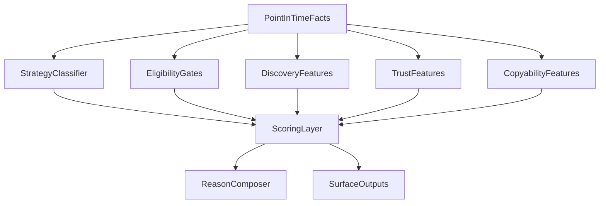

# Discovery Ranking Model Spec

**Date:** 2026-04-14  
**Parent plan:** `docs/plans/2026-04-14-discovery-platform-master-plan.md`  
**Purpose:** Define how the discovery system should evaluate, classify, score, and explain wallets.

---

## 1. Goal

Build a ranking model that surfaces wallets early **without** confusing:

- high PnL with high forecasting skill,
- high activity with high information value,
- profitable but uncopyable strategies with good copy targets,
- small-sample streaks with durable edge.

The ranking model should answer four different questions:

1. Should this wallet surface?
2. How much should we trust it?
3. Can a normal user copy it effectively?
4. What kind of wallet is it?

---

## 2. Ranking Principles

### Principle 1: No single score explains everything

The system should compute multiple score layers and only then decide what to surface.

### Principle 2: Point-in-time inputs must drive discovery

Features known only after resolution should not be allowed to promote a wallet early.

### Principle 3: Trust is a gate, not only a bonus

A wallet with strong discovery potential but very weak integrity should be suppressed.

### Principle 4: Strategy type changes interpretation

Arbitrage, market making, and informational directional trading are not the same thing.

### Principle 5: Small samples should shrink aggressively

New wallets can surface, but confidence and trust should reflect uncertainty.

---

## 3. Model Structure



---

## 4. Wallet Types

Each wallet gets one primary strategy class and optional secondary tags.

## Primary classes

| Class | Meaning | Default UI treatment |
|---|---|---|
| Informational directional | likely entering based on a thesis or information edge | prime discovery and copy candidate |
| Structural arbitrage | exploiting pricing inconsistencies | separate bucket, not default copy target |
| Market maker / liquidity provider | earning edge through spread, queue, or rebates | low default copyability |
| Reactive momentum | follows visible moves quickly and repeatedly | medium-value, more fragile |
| Suspicious / manipulated | behavior inconsistent with trustworthy ranking | suppress or flag |

## Secondary tags

| Tag | Meaning |
|---|---|
| Politics specialist | concentrated success in politics markets |
| Sports specialist | concentrated success in sports markets |
| Event sniper | repeatedly early in thin/new markets |
| Cohort leader | often leads, not follows, wallet clusters |
| High-friction copy | likely hard for normal users to mirror |

---

## 5. Score Stack

## 5.1 Eligibility Gates

Wallets should only be eligible for normal ranking if they pass minimum evidence thresholds.

### Suggested gates

| Gate | Purpose |
|---|---|
| Minimum observation span | avoid day-1 overpromotion |
| Minimum distinct markets | avoid one-market flukes |
| Minimum meaningful notional | avoid tiny-denominator mirages |
| Integrity threshold | suppress suspicious activity |
| Required metadata completeness | avoid inflated certainty from sparse data |

### Output states

| State | Meaning |
|---|---|
| Eligible | can appear in normal ranking |
| Emerging provisional | can surface, but with lower confidence |
| Suppressed | tracked internally but not promoted |

## 5.2 Discovery Score

The discovery score answers:

**“Should this wallet surface now as a potentially valuable find?”**

### Feature families

| Family | Description |
|---|---|
| Early entry | enters before broader crowding |
| Timing quality | repeatedly enters at useful moments |
| Category focus | meaningful specialization over random dabbling |
| Conviction | concentrated, coherent behavior |
| Cohort leadership | tends to lead clusters rather than follow them |
| Market selection quality | chooses higher-signal markets and contexts |

### Discovery-score philosophy

- reward repeatable, early, category-specific edges,
- do not let historical PnL dominate discovery,
- allow emerging wallets to surface when evidence is promising.

## 5.3 Trust Score

The trust score answers:

**“How much should we believe this wallet is real, durable, and not misleading?”**

### Feature families

| Family | Description |
|---|---|
| Sample size | enough data to infer anything useful |
| Stability | repeated behavior across time |
| Market breadth | not only one lucky niche |
| Integrity | low wash or suspicious-loop risk |
| Semantic consistency | strategy and outcomes make economic sense |
| Confidence | evidence quality and freshness |

### Trust-score philosophy

- trust should rise slower than discovery,
- trust should decay when behavior becomes unstable,
- trust should heavily penalize suspicious activity.

## 5.4 Copyability Score

The copyability score answers:

**“Can a normal follower reasonably benefit from mirroring this wallet?”**

### Feature families

| Family | Description |
|---|---|
| Liquidity fit | market depth relative to their size |
| Entry aggressiveness | how much price moves around their fills |
| Strategy reproducibility | whether the style is follower-friendly |
| Holding horizon | enough time for a follower to react |
| Market complexity | neg-risk or structurally complex paths can be harder to copy |

### Copyability philosophy

- separate “smart” from “copyable,”
- do not encourage users to follow structurally uncopyable actors,
- keep copyability central because this is not just an analytics product.

## 5.5 Confidence Score

The confidence score answers:

**“How much evidence supports the current read?”**

### Inputs

- age of evidence,
- number of relevant observations,
- consistency across windows,
- metadata quality,
- stability of classification.

### Presentation

Do not show this as fake-precision percentages by default. Prefer:

- Low
- Medium
- High

with details in the profile page.

---

## 6. Feature Taxonomy

## 6.1 Point-in-Time Features

These can be used for live surfacing at time `t`.

| Feature | Why it belongs here |
|---|---|
| entered before volume acceleration | knowable at trade time |
| position size relative to recent self-history | knowable at trade time |
| category concentration up to time `t` | knowable at trade time |
| recent cadence / consistency | knowable at trade time |
| liquidity fit at entry | knowable at trade time |

## 6.2 Lagging Validation Features

These should validate trust but not promote early discovery by themselves.

| Feature | Why it is lagging |
|---|---|
| realized PnL on resolved markets | requires future resolution |
| realized win rate | requires future resolution |
| Brier or proper-scoring style quality | requires outcome knowledge |
| long-horizon drawdown behavior | requires more time |

## 6.3 Explanation Features

These help the user understand what happened but should not dominate ranking.

| Feature | Use |
|---|---|
| recent notable markets | profile context |
| top counterparties / cohort overlaps | explanation and caution |
| market tags and narratives | UI context |

---

## 7. Scoring Logic

## 7.1 Suggested Decision Order

1. Classify wallet strategy.
2. Compute eligibility and confidence.
3. Compute discovery, trust, and copyability.
4. Apply suppression and penalty logic.
5. Determine surfacing bucket.
6. Generate reasons.

## 7.2 Surface Buckets

| Bucket | Rule of thumb |
|---|---|
| Emerging | high discovery, lower confidence, acceptable trust |
| Trusted | good discovery plus strong trust |
| Copyable | trusted and strong copyability |
| Watch only | interesting but not a clear copy target |
| Suppressed | too suspicious or too weakly supported |

## 7.3 Penalty Logic

Penalties should be explicit, not hidden.

### Example penalty groups

| Penalty | Effect |
|---|---|
| Suspicion penalty | caps trust and surfacing |
| Tiny-sample penalty | reduces confidence and trust |
| Structural-unfriendly penalty | reduces copyability |
| Category-noise penalty | lowers discovery for scattered behavior |

---

## 8. Reason Generation

Each surfaced wallet should have:

1. one primary reason sentence,
2. up to five supporting evidence chips,
3. one caution if relevant.

## Example reason structure

```text
Primary reason:
"Entered multiple politics markets early before broad volume followed."

Supporting chips:
- Category specialist
- Repeat timing quality
- Above-cohort conviction
- Medium confidence

Caution:
- Copyability reduced in thin markets
```

## Reason families

| Family | Example |
|---|---|
| Early timing | entered before broad flow |
| Category edge | strong politics specialization |
| Cohort leadership | often leads a wallet cluster |
| Durability | stable across multiple windows |
| Copyability | follower-friendly size and horizon |
| Caution | small sample, thin liquidity, suspicious loops |

---

## 9. Evaluation Rules

## 9.1 Required evaluation methods

| Method | Purpose |
|---|---|
| Walk-forward evaluation | simulate live behavior |
| Precision@K | check top surfaced wallets |
| Alert precision@K/day | evaluate user-facing alert usefulness |
| Baseline comparison | compare versus naive ranking and random |
| Cohort-relative lift | ensure we are not just picking easy categories |

## 9.2 Anti-cheating rules

- no using resolution data in point-in-time rank features,
- no using final market states to define early signals,
- no comparing results only against current survivors,
- no presenting small-sample spikes as stable “alpha.”

---

## 10. Recommended Outputs

## 10.1 API shape

Each wallet DTO should expose:

- `strategyClass`
- `discoveryScore`
- `trustScore`
- `copyabilityScore`
- `confidence`
- `surfaceBucket`
- `primaryReason`
- `supportingReasons[]`
- `cautionFlags[]`

## 10.2 UI shape

### Discovery row/card

- wallet identity
- strategy badge
- discovery / trust / copyability summaries
- reason sentence
- caution chip if needed
- actions: `View`, `Watch`, `Track`

### Wallet profile

- score stack
- confidence
- category behavior
- timing behavior
- recent markets
- caution panel

---

## 11. Risks

| Risk | Mitigation |
|---|---|
| overfitting score weights | use walk-forward validation |
| too many score dimensions | keep primary UI simple, details on profile |
| score instability | add smoothing and confidence-aware presentation |
| confusing strategy classes | keep classes few and interpretable |
| reasons that feel fake | generate reasons from actual score contributors only |

---

## 12. Final Recommendation

The ranking model should not be implemented as a single scoreboard formula.

It should be implemented as a **layered decision system**:

- classify,
- gate,
- score,
- suppress,
- explain,
- surface.

That is the only model shape that is likely to be both useful and trustworthy.
