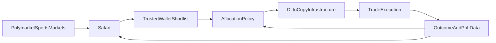
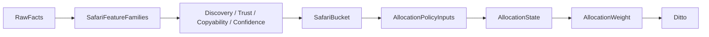

# Safari + Ditto Master Plan

**Date:** 2026-04-14  
**Status:** Research complete, planning active  
**Priority:** Highest product priority after core copy-trading stability  
**Positioning:** `Safari` is the discovery and trust engine. `Ditto` is the existing copy-trading infrastructure.  
**Scope:** sports-first launch, nearly-free core data architecture, trustworthy wallet ranking, separate allocation policy layer, explainable UI, evaluation, migration

---

## 1. Executive Summary

The product should evolve into three clearly separated layers:

- **Safari**: finds, evaluates, ranks, and explains wallets worth following
- **Allocation policy layer**: decides how aggressively a Safari-approved wallet should be mirrored
- **Ditto**: the existing copy-trading infrastructure that executes the mirroring




Today the app is strongest at the last mile: copying trades after the user already knows which wallet to follow. The next leap is to win the first mile:

- find wallets before they become obvious,
- decide whether they are worth trusting,
- decide whether they are worth copying,
- decide how aggressively to allocate,
- improve the system over time without overfitting or burning money on infrastructure.

The core recommendation is:

1. Build **Safari first**, because discovery and trust are the bottleneck.
2. Add a separate **allocation policy layer** between Safari and Ditto.
3. Keep **Ditto** tightly integrated, but use it only as the existing copy-trading infrastructure.
4. Launch **sports-first**, because that gives the narrowest and cleanest niche to calibrate on.
5. Be **ML-ready**, but do not make the first serious version dependent on active model retraining.
6. Keep the core architecture **nearly free** by relying on official public Polymarket data surfaces plus lightweight storage and workers.

---

## 2. Product Thesis

### 2.1 What Safari is

Safari is the product’s **proof-of-trust engine**.

Its job is not just to identify “who is winning.” Its job is to determine:

- who is genuinely promising,
- who is trustworthy,
- who is copyable,
- who is just noisy, lucky, manipulative, or structurally uncopyable.

Safari should answer:

1. Who should surface right now?
2. Why are they surfacing?
3. How confident are we?
4. What kind of wallet is this?
5. Should this wallet feed the allocation policy layer and then into Ditto?

### 2.2 What Ditto is

Ditto is the product’s **existing copy-trading infrastructure**.

Its job is to:

- receive approved wallets and copy-trading instructions,
- execute mirroring behavior,
- apply the existing copy-trading pipeline safely,
- remain the downstream execution system.

Safari discovers. The allocation policy layer decides posture. Ditto executes.

### 2.3 What the allocation policy layer is

The allocation policy layer is the new control system that sits between Safari and Ditto.

Its job is to:

- monitor Safari-approved wallets,
- track state changes,
- determine allocation intensity,
- de-risk when the edge fades,
- pause when trust or performance deteriorates.

### 2.4 Why sports-first

A sports-first launch is the right first implementation boundary because it gives:

- a narrower and more interpretable market set,
- stronger niche specialization signals,
- cleaner messaging,
- faster calibration,
- lower scope risk than “solve all of Polymarket discovery.”

This does **not** mean Safari is permanently sports-only. It means the first production-quality loop should be built and validated there first.

---

## 3. Product Architecture

## 3.1 Top-level architecture

```mermaid
flowchart TD
    gamma[GammaAPI] --> safariScan[SafariScanner]
    dataApi[DataAPI] --> safariScan
    clob[CLOBReadsAndMarketContext] --> safariScan
    subgraph[OptionalPublicSubgraph] --> safariScan

    safariScan --> safariFeatures[SafariFeatureEngine]
    safariFeatures --> safariTrust[SafariTrustEngine]
    safariFeatures --> safariRank[SafariRankingEngine]
    safariTrust --> safariRank
    safariRank --> safariReasons[SafariReasonEngine]
    safariRank --> safariProfiles[SafariWalletProfiles]

    safariProfiles --> policyState[AllocationStateMachine]
    safariProfiles --> policyAlloc[AllocationPolicyEngine]
    policyState --> policyAlloc
    policyAlloc --> dittoInfra[DittoCopyInfrastructure]
    dittoInfra --> tradeOutcomes[ExecutionAndPnLOutcomes]

    tradeOutcomes --> safariEval[SafariEvaluation]
    tradeOutcomes --> policyEval[AllocationPolicyEvaluation]
    tradeOutcomes --> dittoEval[DittoExecutionEvaluation]
```


## 3.2 Layer split

### Layer 1: Safari Scanner

Discovers and tracks wallets using low-cost market and wallet data.

### Layer 2: Safari Ranking + Trust

Builds wallet features, trust assessments, score stack, reasons, and profile state.

### Layer 3: Allocation Policy Layer

Maps Safari output into execution states and capital allocation behavior.

### Layer 4: Evaluation

Separately evaluates:

- Safari’s ability to surface good wallets,
- allocation policy quality,
- Ditto execution quality and slippage,
- cost and operational efficiency.

---

## 4. Safari

## 4.1 Safari goals

Safari should:

- find wallets before they are obvious,
- measure quality rather than vanity,
- separate wallet types,
- justify its ranking,
- create a shortlist that the allocation policy layer can safely consume.

## 4.2 Safari score stack

Safari should not use one monolithic score internally.

It should compute:


| Layer             | Purpose                              |
| ----------------- | ------------------------------------ |
| Discovery score   | should this wallet surface now?      |
| Trust score       | should we believe this wallet?       |
| Copyability score | can a normal user follow it?         |
| Confidence score  | how much evidence supports the read? |
| Strategy class    | what kind of wallet is this?         |


Externally, the UI can present a branded **Safari score** if desired, but only as a summary layer above the full score stack.

## 4.3 Safari feature pillars

The current team ideas plus research suggest five strong first pillars:


| Pillar                        | Meaning                                                     | Notes                                                  |
| ----------------------------- | ----------------------------------------------------------- | ------------------------------------------------------ |
| Niche knowledge               | focused strength in the categories we care about            | sports-first at launch                                 |
| Probabilistic accuracy        | how well wallet-implied probabilities line up with outcomes | more useful for trust than early discovery             |
| Market edge / CLV-style value | do their entries beat later market consensus?               | likely one of the strongest differentiators            |
| Risk DNA / consistency        | do they size and behave coherently?                         | useful, but only on observable on-platform behavior    |
| Momentum / heat               | are they currently outperforming their own baseline?        | useful as a modifier, dangerous as a core truth source |


Important refinement:

- **Discovery stage** should lean on point-in-time signals and niche specialization.
- **Trust stage** should incorporate probabilistic accuracy, durability, and integrity.
- **Copyability stage** should incorporate liquidity and reproducibility.
- **Allocation policy stage** can incorporate momentum more aggressively.

## 4.4 Safari wallet classes

Each wallet should receive one primary strategy class:


| Class                             | Meaning                                 | Default treatment       |
| --------------------------------- | --------------------------------------- | ----------------------- |
| Informational directional         | likely forecasting skill or thesis edge | strong Safari candidate |
| Structural arbitrage              | exploits market structure               | watch and separate      |
| Market maker / liquidity provider | profits from spread/rebate dynamics     | low default copyability |
| Reactive momentum                 | follows visible moves quickly           | useful but less early   |
| Suspicious / manipulated          | integrity concerns                      | suppress or caution     |


## 4.5 Safari output buckets


| Bucket     | Meaning                                                                    |
| ---------- | -------------------------------------------------------------------------- |
| Emerging   | interesting early wallet, still building confidence                        |
| Trusted    | strong, stable Safari candidate                                            |
| Copyable | Safari-approved and strong input for the allocation policy layer and Ditto |
| Watch-only | interesting but not default copy target                                    |
| Suppressed | too risky, too noisy, or too weakly supported                              |


---

## 5. Allocation Policy Layer

## 5.1 Allocation policy goals

The allocation policy layer should consume Safari-approved wallets and decide:

- whether to mirror,
- how much to mirror,
- when to upsize,
- when to de-risk,
- when to pause.

## 5.2 Allocation state machine

The team’s proposed state framing is strong and should become the official allocation state layer that feeds Ditto.


| State                  | Meaning                             | Default action          |
| ---------------------- | ----------------------------------- | ----------------------- |
| `NEW / UNRANKED`       | not enough evidence yet             | monitor only            |
| `CONSISTENT PERFORMER` | stable and trustworthy              | standard allocation     |
| `HOT STREAK`           | strong recent state above threshold | upsize within hard caps |
| `SLOWING / REVERTING`  | edge weakening                      | de-risk                 |
| `COOLDOWN / PAUSED`    | trust or performance too weak       | stop mirroring          |


## 5.3 Allocation control logic

The allocation policy layer should use:

- sample-size gating,
- hysteresis,
- exposure caps,
- rebalance cadence,
- pause logic.

Hysteresis rule:

- the allocation policy layer should not instantly thrash between states when a score moves near a boundary.

Exposure rule:

- hot streak should increase allocation **within hard caps**, not create open-ended leverage to recent variance.

## 5.4 Allocation policy inputs

The allocation policy layer should consume:

- Safari discovery/trust/copyability/confidence,
- recent momentum state,
- execution quality,
- current portfolio concentration,
- liquidity constraints.

## 5.5 Allocation policy outputs

The allocation policy layer should produce:

- target allocation weight,
- state label,
- upsize/de-risk/pause action,
- explanation for why the state changed.

---

## 6. Scoring Philosophy

## 6.1 What should not happen

The system should **not**:

- rank wallets mainly by raw PnL,
- treat hot streaks as durable truth,
- use realized outcomes to fake early discovery,
- let Ditto execution outcomes overwrite Safari truth too aggressively,
- mix arbitrageurs, market makers, and directional wallets on one default board.

## 6.2 Recommended score hierarchy




Safari should produce **wallet truth**.  
The allocation policy layer should produce **capital behavior**.  
Ditto should remain the **copy-trading infrastructure** that carries out that behavior.

---

## 7. Data Architecture

## 7.1 Core source posture

Keep the default system nearly free.


| Tier     | Source                 | Purpose                             |
| -------- | ---------------------- | ----------------------------------- |
| Core     | Gamma API              | market universe and tags            |
| Core     | Data API               | wallet and trade discovery          |
| Core     | selective CLOB reads   | copyability and market-edge context |
| Optional | public subgraph        | corroboration and deeper history    |
| Fallback | raw Polygon / paid RPC | only if justified                   |


## 7.2 Storage layers


| Layer                | Purpose                                         |
| -------------------- | ----------------------------------------------- |
| Safari facts         | normalized point-in-time trade and wallet facts |
| Safari features      | computed wallet feature snapshots               |
| Safari scores        | discovery/trust/copyability/confidence outputs  |
| Safari reasons       | explanation payloads                            |
| Allocation states    | current and historical allocation states        |
| Allocation decisions | weights, actions, transitions                   |
| Evaluation snapshots | walk-forward and execution review               |
| Cost telemetry       | provider usage and estimated cost               |


## 7.3 Runtime topology

Use one authoritative worker model:

- Safari worker:
  - ingestion
  - features
  - scores
  - reasons
  - profiles
- allocation policy engine:
  - state transitions
  - capital weights
  - execution input generation

The app server should read and render, not compute competing truths.

---

## 8. Evaluation

## 8.1 Safari evaluation

Safari should be evaluated on:

- walk-forward ranking quality,
- precision@k of surfaced wallets,
- category-specific lift,
- confidence calibration,
- reduction in noisy or suspicious surfaced wallets.

## 8.2 Allocation policy evaluation

The allocation policy layer should be evaluated on:

- allocation quality versus fixed-weight baseline,
- drawdown control,
- state-transition quality,
- slippage-adjusted realized performance,
- reaction to slowing or cooling wallets.

## 8.3 Ditto execution evaluation

Ditto itself should be evaluated as infrastructure:

- execution correctness,
- slippage and latency behavior,
- safety and reliability,
- alignment with allocation instructions.

## 8.4 Separation rule

Do not let Safari and the allocation policy layer share one evaluation metric.

Safari should answer:

- did we find the right wallets?

The allocation policy layer should answer:

- did we allocate to them well?

Ditto should answer:

- did we execute the intended mirroring correctly?

---

## 9. ML Strategy

Be **ML-ready**, not **ML-dependent** in the first serious version.

Why:

- labels arrive slowly,
- outcomes are confounded by execution quality,
- sample sizes are noisy,
- it is easy to overfit.

Phase approach:

- **Phase 1:** rules-first, feature-rich, manual calibration, strong evaluation instrumentation
- **Phase 2:** offline model experiments, advisory ML scoring, compare against rules-first baseline
- **Phase 3:** limited production ML influence only if proven

---

## 10. UI Vision

## 10.1 Safari UI surfaces


| Surface               | Purpose                          |
| --------------------- | -------------------------------- |
| Safari feed           | what deserves attention now      |
| Safari leaderboard    | dense ranked browsing            |
| Safari wallet profile | why a wallet matters             |
| Compare               | choose between candidate wallets |
| Watchlist             | monitor selected wallets         |
| Methodology           | explain the system               |

### Wallet identity fallback

Safari should not default to unreadable raw wallet addresses when a Polymarket account has no username or pseudonym attached.

When no readable account name exists, Safari should:

- generate a stable, human-readable fallback alias,
- use a random animal style name,
- keep the true wallet address visible on drill-down and copy actions,
- make the alias deterministic for that wallet so it stays consistent across sessions.

Example fallback names:

- `Silver Otter`
- `Blue Falcon`
- `Quiet Panther`

This should be treated as a real usability requirement, not a polish detail, because discovery is a scan-heavy product and users need readable handles to remember, compare, and discuss wallets.


## 10.2 Ditto and allocation UI surfaces


| Surface                | Purpose                                              |
| ---------------------- | ---------------------------------------------------- |
| Allocation state board | show which wallets are active, hot, slowing, paused  |
| Allocation panel       | show capital weights and risk posture                |
| Transition log         | explain why allocation changed                       |
| Ditto execution panel  | show copy-trading infrastructure behavior and health |


Safari says:

- “here’s who matters”

The allocation policy layer says:

- “here’s how we are acting on it”

Ditto says:

- “here’s what the copy-trading infrastructure is executing”

---

## 11. Implementation Roadmap

## Phase 1: Safari Foundation

Build one authoritative Safari discovery pipeline.

Deliverables:

- sports-first market universe
- wallet scanner
- point-in-time fact storage
- Safari score stack
- reasons payload
- Safari feed MVP

## Phase 2: Allocation Policy Layer

Add controlled capital allocation logic on top of Safari output.

Deliverables:

- allocation state layer
- hysteresis rules
- allocation weights
- de-risk and pause logic

## Phase 3: Evaluation and Calibration

Measure whether Safari finds the right wallets and whether the allocation policy layer allocates well.

Deliverables:

- walk-forward Safari eval
- allocation policy comparisons
- cost telemetry

## Phase 4: Productization

Turn Safari + Ditto into a full, explainable product flow.

Deliverables:

- profile pages
- compare
- watchlist
- alert center
- methodology page

## Phase 5: Advanced Learning

Layer in ML only when the evidence base is large enough.

Deliverables:

- feature store refinement
- offline model comparison
- guarded production experimentation

---

## 12. Risks


| Risk                                                     | Mitigation                                                        |
| -------------------------------------------------------- | ----------------------------------------------------------------- |
| sports-first feels too narrow                            | treat it as launch scope, not final product limit                 |
| Safari and allocation-policy semantics blur together     | keep separate score and state systems                             |
| momentum dominates too much                              | use it mainly in the allocation policy layer, not as Safari truth |
| ML loop overfits early                                   | keep ML advisory at first                                         |
| low-cost architecture misses useful data                 | instrument coverage gaps and add upgrades only when justified     |
| the current split discovery system causes migration pain | build a v2 additive migration path                                |


---

## 13. Success Metrics

## Safari success

- surfaces valuable wallets before they become obvious leaderboard names,
- shows reasons users can understand,
- suppresses noisy or suspicious actors better than the current system,
- works from a nearly-free data architecture.

## Allocation policy success

- allocates capital more intelligently than fixed mirroring,
- avoids overcommitting to hot streak noise,
- de-risks or pauses quickly when edge fades,
- improves realized performance or drawdown profile versus naive allocation.

## Ditto success

- executes the intended copy-trading behavior reliably,
- stays aligned with allocation instructions,
- preserves existing safety and infrastructure expectations.

---

## 14. Decision Summary


| Decision                         | Recommendation                                                                       |
| -------------------------------- | ------------------------------------------------------------------------------------ |
| Discovery engine name            | Safari                                                                               |
| Copy-trading infrastructure name | Ditto                                                                                |
| Allocation-control layer         | neutral internal layer feeding Ditto                                                 |
| Launch scope                     | sports-first                                                                         |
| Core data architecture           | nearly-free, public-API-first                                                        |
| Ranking approach                 | layered Safari stack, not one raw score                                              |
| Allocation approach              | separate policy state machine with hysteresis and caps                               |
| ML posture                       | ML-ready, not ML-dependent initially                                                 |
| Product structure                | Safari feed + profile + leaderboard + allocation state board + Ditto execution panel |


---

## 15. Final Recommendation

The right strategy is not “build a better leaderboard.”

The right strategy is to build:

- **Safari** as the proof-of-trust discovery layer
- a separate **allocation policy layer** that controls exposure and state
- **Ditto** as the existing copy-trading infrastructure that executes the plan

That gives the product a coherent identity, a sharper roadmap, and a cleaner technical architecture than the earlier generic discovery framing.