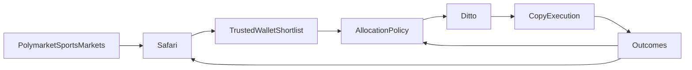
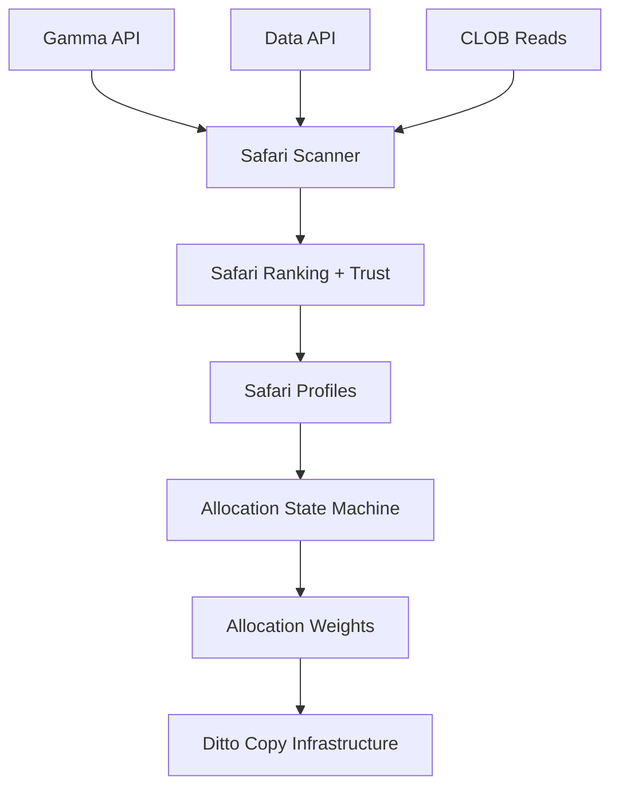

# Safari + Ditto

## Team Presentation

**Audience:** internal team review  
**Date:** 2026-04-14  
**Purpose:** explain the proposed product direction, architecture, and rollout in a short format

---

## Slide 1: The Big Idea

### We are building three layers

- **Safari** = discovery and trust engine
- **Allocation policy layer** = decides how aggressively to mirror Safari-approved wallets
- **Ditto** = the existing copy-trading infrastructure

### Why this matters

Right now we can copy a wallet once we know who to follow.  
The missing edge is finding the right wallets **early** and deciding **how aggressively** to mirror them.

---

## Slide 2: The Problem

### Today’s limitation

- leaderboard-style discovery is too late
- raw PnL is not enough
- some wallets are lucky, noisy, manipulative, or uncopyable
- the current discovery code is architecturally split

### Product problem

We solve the last mile well.  
We do not solve the first mile well enough.

---

## Slide 3: The New Product Loop

### In plain language

- Safari finds and vets wallets
- the allocation policy layer decides posture and weights
- Ditto executes the copy-trading behavior

---

## Slide 4: Safari

### Safari’s job

- find wallets early
- rank them by quality, not just visibility
- explain why they surfaced
- determine whether they are worth feeding into the allocation policy layer
- auto-name wallets with stable animal-style aliases when no Polymarket username exists

### Safari score stack

- discovery
- trust
- copyability
- confidence
- strategy class

### Key principle

Safari is the **proof-of-trust** engine.

---

## Slide 5: Allocation Policy Layer

### Its job

- monitor Safari-approved wallets
- decide allocation intensity
- upsize when appropriate
- de-risk when the edge fades
- pause when trust or performance breaks down

### Proposed state model

- `NEW / UNRANKED`
- `CONSISTENT PERFORMER`
- `HOT STREAK`
- `SLOWING / REVERTING`
- `COOLDOWN / PAUSED`

### Key principle

Safari decides **who matters**.  
The allocation policy layer decides **what we do about it**.  
Ditto executes it.

---

## Slide 6: Ditto

### What Ditto means here

Ditto is **not** the discovery engine and **not** the allocation logic.

Ditto is the **existing copy-trading infrastructure**:

- receives approved wallets and instructions
- runs mirroring behavior
- remains the downstream execution layer

---

## Slide 7: Why Sports First

### Recommendation

Launch Safari in sports first.

### Why

- narrower market scope
- cleaner niche specialization
- easier calibration
- clearer messaging
- lower implementation risk

### Important note

Sports-first is a launch boundary, not a permanent product limit.

---

## Slide 8: Architecture

### Core architecture principle

Use a nearly-free, public-data-first stack:

- Gamma
- Data API
- selective CLOB reads
- optional public subgraph support

---

## Slide 9: What We Are Not Doing

- not building a generic crypto smart-money terminal
- not relying on social/X data as the core engine
- not using one giant raw PnL score
- not making ML retraining a hard dependency for v1
- not recreating an expensive Alchemy-heavy architecture
- not using the name `Ditto` for discovery or allocation logic

---

## Slide 10: Rollout Plan

### Phase 1

Safari foundation:

- scanner
- point-in-time facts
- score stack
- reasons
- feed MVP

### Phase 2

Allocation policy layer:

- hysteresis
- allocation weights
- de-risk and pause logic

### Phase 3

Evaluation and calibration:

- walk-forward Safari testing
- allocation policy testing
- cost telemetry

### Phase 4

Productization:

- profiles
- compare
- watchlist
- alerts

---

## Slide 11: Success Looks Like

### Safari success

- finds wallets before they are obvious
- surfaces trustworthy candidates
- explains why they matter

### Allocation policy success

- allocates capital better than naive mirroring
- avoids overcommitting to streak noise
- de-risks quickly when edge fades

### Ditto success

- executes the intended copy behavior reliably
- stays aligned with the allocation instructions

---

## Slide 12: Decision Needed

### Team alignment questions

1. Do we agree on **Safari** as the discovery and trust engine?
2. Do we agree that **Ditto** should refer only to the existing copy-trading infrastructure?
3. Do we agree on a separate **allocation policy layer** between Safari and Ditto?
4. Do we agree on **sports-first** launch scope?
5. Do we agree to be **ML-ready, not ML-dependent** at the start?

### Recommendation

Approve the Safari + allocation-policy + Ditto direction and begin Phase 1 planning and implementation.